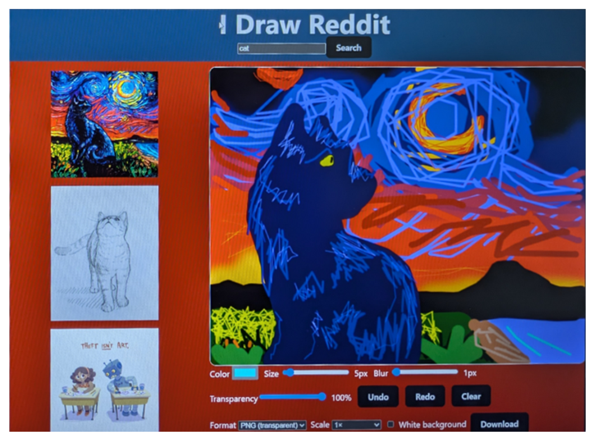
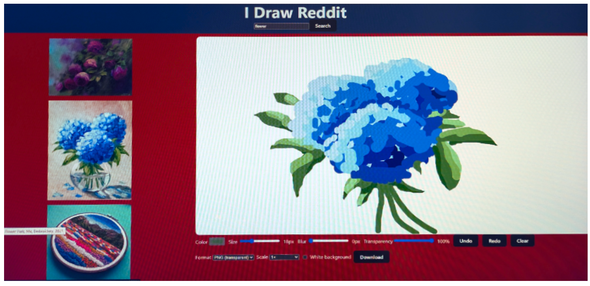

# Welcome to I Draw Reddit
## Live Demo  
[Click here to go to the live site!](https://emmalani3.github.io/redditspeedrun/)

*url: https://emmalani3.github.io/redditspeedrun/*

This is a project for my Codecademy off platform homework where I am learning to code. The purpose was to use an API to pull posts and images from reddit and create a different interface displaying the posts for the users. Instead of just re-skinning reddit I decided to create an interface that allowed users to draw their rendition of reddit art, download it, and follow the link back to the original posts to share their art in the comments like the popular egg meme.

### 🎨 Community Egg Gallery
[▶️ View the Instagram slideshow](https://www.instagram.com/p/DNgS7xMtzqB/?img_index=1)

## Technology
I started with React-Vite and Redux as well as Javascript and worked with ChatGpt to catch errors, clean up code, and help me make my program more efficient. I would write blocks of code for the intended purpose and then ask Gpt for feedback and correctioins.

I used Git and Github for version control and Github Pages to share the app with others.

## Wireframe
The wire frames were simple and change from full screen to mobile so this site works on all screen sizes and is responsive. because we have nested elements one of the most noticable changes is in the gallery. With a long narrow screen the left and right column layout didnt work as well so those elements stack vertically on smaller screens and the gallery loads horizontally.

*Wireframe for desktop*

*Wireframe for mobile*

## Features

### Sign-in and Search
This app is a simple design that allows you to sign into reddit to search for a subject on r/art. This allows it to use the Install App API from reddit which does not require a server and does not cause CORS errors when hosted on GitHub Pages.

### Inspiration Gallery
The search takes the term you input and finds art from r/art that matches the category and returns 3 random images from the search in the gallery. Due to the rate limit it will also store your results so you can access them again without being bounced from reddit if you accidentally refresh or leave the page. If you click on one of the images it will take you to the original post. Hovering over the images will also show the post title.

### Canvas
To the right (or bottom on mobile) there is a white canvas for drawing your art. You can use the mouse or trackpad to create images by clicking and draging to create marks. Each mark is saved and can be un-done and re-done.

*Example of blur transparency and line weight*

### Pen Controls
Below the canvas there are pen controls that allow you to change the color of your brush, the size of a stroke diameter, the transparency of the stroke, and the bluriness of the stroke edge. These give you the ability to draw almost any basic line you would like. With the blur and transparency you can also layer colors and create even color transitions with a little practice. There is also a undo redo and clear in the event you dont like a mark, accidentally deleted a mark you liked, or want to start over completely.

*Example of pen color and weight variation: Image of cat on stary night background*

*Example of color layering using blur: Image of color from blue to orange transition*

*Example of transparency and color overlay: Image of yellow to blue transition*

*Example of brush size and opaque overlay: Image of flower using dots and size changes with white background*

### Download Your Art
After creating your images you can choose how you want to download your image and save the file. Choices include png vs jpg transparent background vs white background, and size of file small or large.

*Screenshot of UI with inspiration and drawing*

*Downloaded file*

## Acknowledgments
- [Codecademy](https://www.codecademy.com/) for the original assignment  
- Reddit for the API  
- The viral [egg meme](https://www.instagram.com/p/DNgS7xMtzqB/?img_index=1) for inspiration  
- ChatGPT for debugging and feedback  

## License
This project is licensed under the [CC BY-NC 4.0](https://creativecommons.org/licenses/by-nc/4.0/) license.  
You may use, share, and remix this project with credit, but not for commercial purposes.

